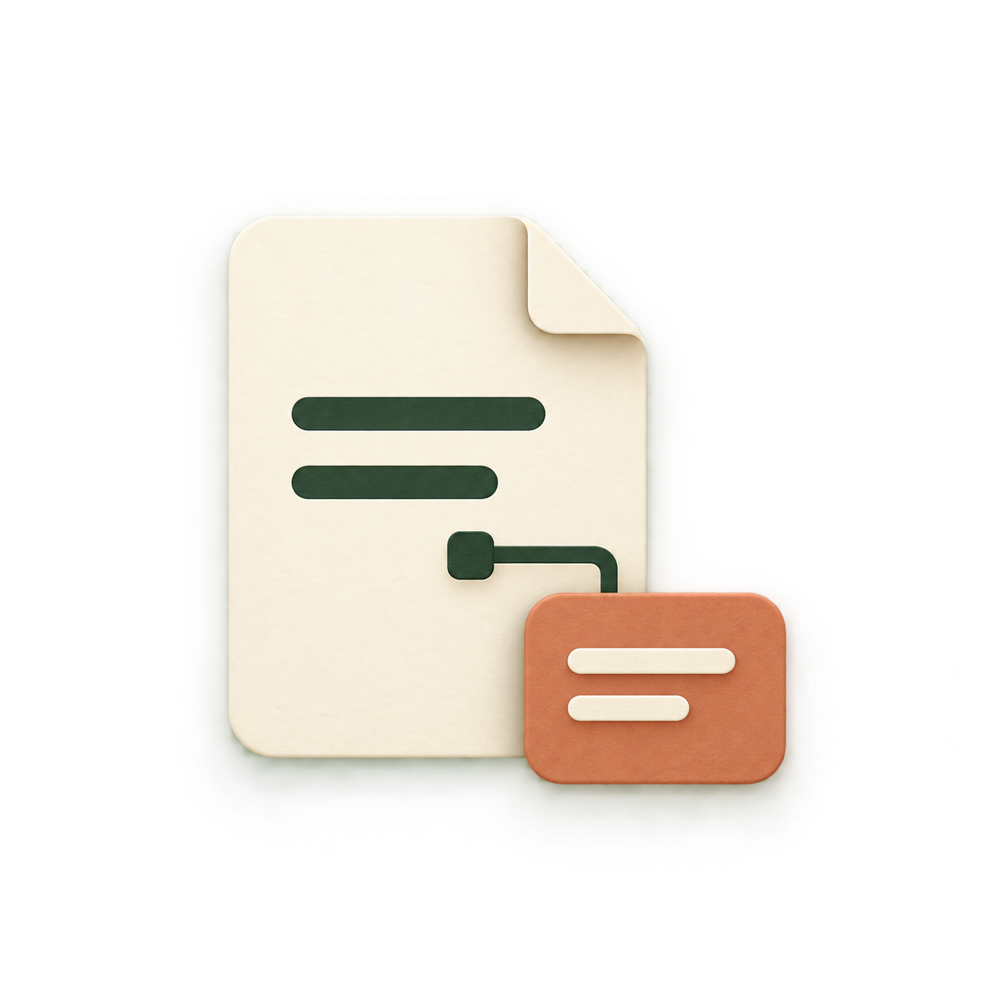
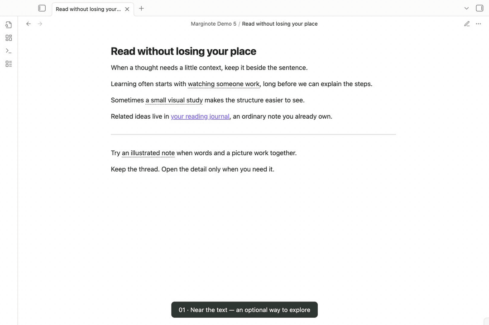

# Marginote

<p align="center">
  
</p>

<p align="center"><strong>Keep the context. Stay with the page.</strong></p>

<p align="center">
  <a href="https://github.com/t1seo/marginote/actions/workflows/check.yml"></a>
  <a href="https://github.com/t1seo/marginote/releases/latest"></a>
  <a href="LICENSE"></a>
</p>

Connect words in your Obsidian notes to floating text and image cards. A fine outline and connector keep each card tied to its place in the page. Preview ordinary note links the same way, and choose which kinds of links Marginote handles.



[Watch the MP4](docs/demo/marginote.mp4) · [View a still](docs/demo/poster.png) · [Try the sample vault](examples/reading-vault) · [Recording details](docs/demo/README.md)

The demo uses real Obsidian with an English interface and sample notes, plus varied Lorem ipsum passages for scrolling. Move left, below, and right of a link to see its card follow in both Reading view and Live Preview. It also shows stationary hover, click pinning, ordinary note previews, and a card farther down the page. The pointer marker and captions are recording aids. See the recording details for the captured version.

## A quick tour

1. Select a short phrase while editing a note.
2. Run **Marginote: Create annotation card from selection** from the command palette.
3. Choose **Text**, **Image**, or **Text and image**, then add your content. Images use an existing file in your vault.
4. Select **Create card**. Marginote saves a Markdown card in `Annotations/` and links the selected phrase to it.
5. Move beside or below the phrase in Reading view or Live Preview. Its card appears nearby and follows your pointer. Click the phrase to keep the card open.

| What you can preview | What appears |
| --- | --- |
| Text card | A definition, explanation, or short Markdown note |
| Image card | A local image connected to the source phrase |
| Text and image card | An illustration with its explanation |
| Ordinary note link | The note's title, path, and a read-only excerpt, with **Open note** |

Cards follow Obsidian's light and dark appearance. Each window shows one card at a time, positioned within its note pane.

## Choose what appears

Open **Settings → Marginote**. Two settings control the experience:

| Setting | Options | Default |
| --- | --- | --- |
| Preview content | Annotation cards only / Ordinary note links only / Both | Annotation cards only |
| Automatic preview | Near text · follows pointer / Over link · stays in place / Off | Near text · follows pointer |

**Near text · follows pointer** opens a preview within 300 pixels beside or below an eligible link, inside the same note pane. You do not need to touch the link. The card follows your pointer and updates as you scroll. These passive previews let pointer input pass through and disappear after a reading interval. Click the source link to open an interactive card. Automatic proximity previews use a mouse or trackpad in windows at least 768 pixels wide.

**Over link · stays in place** opens a stationary card after a short pause directly over the link, about 250 ms. Move the pointer onto the card to keep reading; it does not expire while you read it.

**Off** disables automatic previews. Click, tap, or use the keyboard to open a card explicitly.

Existing saved preferences survive upgrades. If you used an earlier version, choose **Near text · follows pointer** to switch from stationary hover to proximity previews.

Choose **Ordinary note links only** if you want link previews without annotation cards, or **Both** to use both kinds. Changes apply to open views and windows immediately. Links outside your selection keep their usual Obsidian behavior.

## Read without losing your place

- Click, tap, or press **Enter** or **Space** on a supported link to keep its card open.
- Press **Escape**, use **Close**, or click outside the card to dismiss it.
- Use **Edit card** to open a card's Markdown note, or **Open note** to read an ordinary note in full.
- **Cmd/Ctrl-click** keeps Obsidian's normal link navigation.
- Dragging, selecting text, and composition input suppress automatic previews.
- Closing explicitly returns focus to the link in Reading view, or to the native editor in Live Preview while preserving an existing selection.

Ordinary note previews hide frontmatter and show an excerpt of up to approximately 6,000 characters. An excerpt notice appears when content is shortened. Previewing a note does not add card metadata or change its contents.

## Your cards are Markdown

Marginote uses ordinary wikilinks in your source note:

```md
Learning can begin with [[Annotations/Learning by observation|watching someone think]].
```

The card is a separate Markdown file with a stable ID:

```md
---
marginote-card: 1
marginote-id: de7505c2-e964-499a-8824-bfdccbe43272
marginote-kind: text
---
Watch which choices an expert makes, and ask what changed their mind.
```

Image cards can contain `![[Attachments/notebook-study.svg]]`. Mixed cards combine an image with Markdown text. The same visible phrase can link to different cards.

Place the editor cursor inside a card link and run:

- **Edit annotation card at cursor** to open the original card.
- **Unlink annotation card at cursor** to restore the visible phrase.

Unlinking or undoing an insertion does not delete the card note or its images. Existing files are never overwritten when creating a card.

## Installation

Marginote requires **Obsidian 1.10.6 or later on desktop**. The plugin ID is `marginote`.

### GitHub release

1. Download `main.js`, `manifest.json`, and `styles.css` from the [latest release](https://github.com/t1seo/marginote/releases/latest).
2. Copy them into `<vault>/.obsidian/plugins/marginote/`.
3. Reload Obsidian and enable **Marginote** in **Settings → Community plugins**.

### BRAT

If you already use [BRAT](https://github.com/TfTHacker/obsidian42-brat), add `https://github.com/t1seo/marginote` as a beta plugin, then enable Marginote.

### Community directory

The [Marginote Community page](https://community.obsidian.md/plugins/marginote) is public. On September 19, 2026, Marginote was still absent from the in-app directory search tested in Obsidian 1.10.6. Until it appears there, use the GitHub release instructions above. See the [submission status](docs/release/submission.md) for the review and installation observations.

## Sample vault

The [sample vault](examples/reading-vault) contains the English notes and original illustration used in the demo, including text, image, mixed, and ordinary-note examples. A longer reading passage uses varied Lorem ipsum paragraphs to try scrolling and returning to a linked idea. Open a copy as a separate Obsidian vault and install the three release files there. The sample guide explains the two preview settings.

## Privacy and compatibility

Marginote works locally. It requires no account, API key, payment, or network service, and includes no telemetry. Cards and images remain in your vault; plugin preferences are saved by Obsidian in the plugin's local data file.

Only local wiki image embeds are loaded automatically inside previews. Markdown image syntax is shown as a literal image marker followed by a link, and raw HTML is shown as text. Following an external link remains a deliberate navigation action.

- **Reading view:** supported local links to whole Markdown notes.
- **Live Preview:** whole-note `[[wikilinks]]`, including aliases. Markdown-style `[links](Note.md)` are not decorated in Live Preview.
- **Source mode:** normal source editing remains available.
- **Heading links, block links, and note embeds:** retain Obsidian's behavior.
- **Desktop:** tested in Obsidian 1.10.6, including split panes, pop-out windows, light/dark appearance, and zoom.
- **Mobile:** not supported in this release. Touch and composition checks used Chromium input automation; physical mobile devices and operating-system IMEs were not certified.

Complex nested Markdown may render differently from the full note. Passive proximity previews have a different accessibility contract from stationary hover and explicit cards; this release does not claim comprehensive screen-reader or WCAG certification.

## Development

Use Bun 1.3.14:

```sh
bun install --frozen-lockfile
bun run check
bun run check:release
```

See [Contributing](CONTRIBUTING.md), the [release verification record](docs/release/verification.md), and [release instructions](docs/RELEASING.md). Obsidian, CodeMirror, and Lezer remain host-provided modules.

## Support

Please [open an issue](https://github.com/t1seo/marginote/issues) with your Obsidian version, operating system, view mode, and a small example note. Avoid attaching personal vault contents.

## Credits and license

Created by [t1seo](https://github.com/t1seo). The card geometry was adapted from the maintainer's Library of Alexandria project for Obsidian's editor and window lifecycle. The sample writing, illustration, and Marginote icon were created for this plugin.

[MIT](LICENSE). Bundled dependency attribution is preserved in [Third-party notices](THIRD_PARTY_NOTICES.md).
